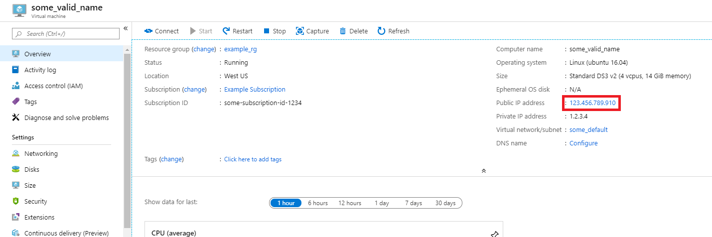
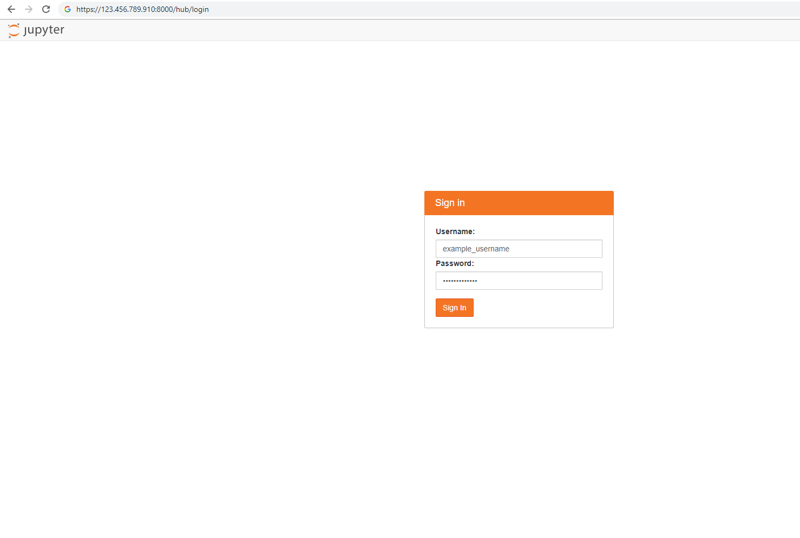
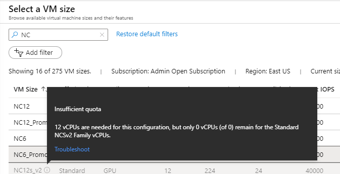
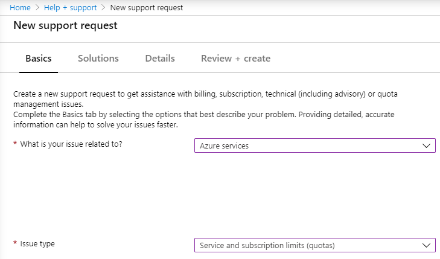

# Quickstart: Set up the Data Science Virtual Machine for Linux (Ubuntu)

Get up and running with the Ubuntu 18.04 Data Science Virtual Machine.

## Prerequisites

To create an Ubuntu 18.04 Data Science Virtual Machine, you must have an Azure subscription.
Please note Azure free accounts do not support GPU enabled virtual machine SKUs.

## Create your Data Science Virtual Machine for Linux

Here are the steps to create an instance of the Data Science Virtual Machine Ubuntu 18.04:

1. Go to the [Azure portal](https://portal.azure.com) You might be prompted to sign in to your Azure account if you're not already signed in.
1. Find the virtual machine listing by typing in "data science virtual machine" and selecting **"Data Science Virtual Machine- Ubuntu 18.04"**

1. On the subsequent window, select **Create**.

1. You should be redirected to the "Create a virtual machine" blade.
   
1. Enter the following information to configure each step of the wizard:

    1. **Basics**:
    
       * **Subscription**: If you have more than one subscription, select the one on which the machine will be created and billed. You must have resource creation privileges for this subscription.
       * **Resource group**: Create a new group or use an existing one.
       * **Virtual machine name**: Enter the name of the virtual machine. This is how it will appear in your Azure portal.
       * **Region**: Select the datacenter that's most appropriate. For fastest network access, it's the datacenter that has most of your data or is closest to your physical location. Learn more about [Azure Regions](https://azure.microsoft.com/global-infrastructure/regions/).
       * **Image**: Leave the default value.
       * **Size**: This should auto-populate with a size that is appropriate for general workloads.
       * **Authentication type**: For quicker setup, select "Password." 
         
         > [!NOTE]
         > If you intend to use JupyterHub, make sure to select "Password," as JupyterHub is *not* configured to use SSH public keys.

       * **Username**: Enter the administrator username. This is the username you will use to log into your virtual machine, and need not be the same as your Azure username. Do *not* use capitalized letters.
         
         > [!NOTE]
         > If you use capitalized letters in your username, JupyterHub will not work, and you will encounter a 500 internal server error.

       * **Password**: Enter the password you will use to log into your virtual machine.    
    
   1. Select **Review + create**.
   1. **Review+create**
      * Verify that all the information you entered is correct. 
      * Select **Create**.
    
    The provisioning should take about 5 minutes. The status is displayed in the Azure portal.

## How to access the Ubuntu Data Science Virtual Machine

You can access the Ubuntu DSVM in one of three ways:

  * SSH for terminal sessions
  * JupyterHub and JupyterLab for Jupyter notebooks

### SSH

After the VM is created, if it was configured with SSH access, you can sign in to it by using SSH. Use the account credentials that you created in the **Basics** section of step 3 for the text shell interface. On Windows, you can download an SSH client tool like [PuTTY](https://www.putty.org). If you prefer a graphical desktop (X Window System), you can use X11 forwarding on PuTTY.

### Attach a new disk as additional storage

You need to perform the following steps:

  1. Attach new disk via the DSVM blade in Azure portal
  2. SSH to DSVM
  3. Review the disk space by running the following command
```bash
df -h
```
  4. Mount the disk and edit fstab file 
  5. Restart and verify the setting

For details, please refer to [Use the portal to attach a data disk to a Linux VM](https://docs.microsoft.com/en-us/azure/virtual-machines/linux/attach-disk-portal)

### Resize the data disk 

You need to perform the following steps:

  1. Shut down the DSVM and resize the disk via Azure portal
  2. Start and connect to DSVM via SSH
  3. Unmount the disk and resize the disk
  4. Expand the disk and mount the disk back 
  5. Restart and verify the setting

For details, please refer to [Expand virtual hard disks on a Linux VM with the Azure CLI](https://docs.microsoft.com/en-us/azure/virtual-machines/linux/expand-disks)

### JupyterHub and JupyterLab

The Ubuntu DSVM runs [JupyterHub](https://github.com/jupyterhub/jupyterhub), a multiuser Jupyter server. To connect, take the following steps:

   1. Make note of the public IP address for your VM, by searching for and selecting your VM in the Azure portal.
      

   2. From your local machine, open a web browser and navigate to https:\//your-vm-ip:8000, replacing "your-vm-ip" with the IP address you took note of earlier.
   3. Your browser will probably prevent you from opening the page directly, telling you that there is a certificate error. The DSVM is providing security via a self-signed certificate. Most browsers will allow you to click through after this warning. Many browsers will continue to provide some kind of visual warning about the certificate throughout your Web session.
   4. Enter the username and password that you used to create the VM, and sign in. 

      

   5. Browse the many sample notebooks that are available.

JupyterLab, the next generation of Jupyter notebooks and JupyterHub, is also available. To access it, sign in to JupyterHub, and then browse to the URL https:\//your-vm-ip:8000/user/your-username/lab, replacing "your-username" with the username you chose when configuring the VM. Again, you may be initially blocked from accessing the site due to a certificate error.

You can set JupyterLab as the default notebook server by adding this line to `/etc/jupyterhub/jupyterhub_config.py`:

```python
c.Spawner.default_url = '/lab'
```

## Troubleshoot

### Insufficient Quota in using GPU-enabled Virtual Machine

By default, your subscription might not have sufficient quota in using N-series VM. When you are selecting the size of VM, you will see the following message.



You can submit a support ticket from Azure portal.

