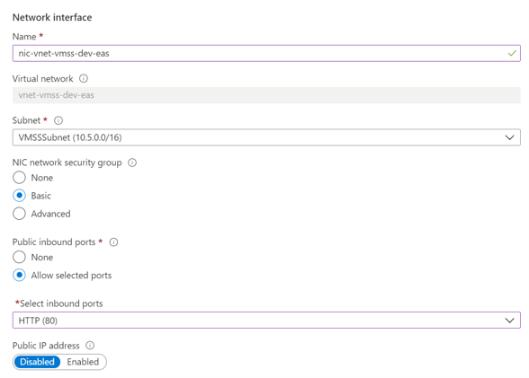
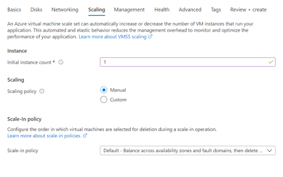

# Custom VMSS Deployment Walkthrough

[home](../README.md)

## Technical Implementation

### Step 1 - Create Custom Image Virtual Machine

1. Create [Linux - Ubuntu](https://docs.microsoft.com/en-us/azure/virtual-machines/linux/quick-create-portal) VM via Azure Portal

   

1. Configure VM as Ngnix Server
   Install web server
   ```
   sudo apt-get -y update
   sudo apt-get -y install nginx
   ```
   
1. Prepare VM images

   [Generalized and Specialized images](https://docs.microsoft.com/en-us/azure/virtual-machines/shared-image-galleries#generalized-and-specialized-images)

   **Option 1 - Create Custom Image from Generalized VM**

   [How to create a managed image of a virtual machine or VHD](https://docs.microsoft.com/en-us/azure/virtual-machines/linux/capture-image)

   \*Only follow the steps to generalize the VM

   **Option 2 - Create Disk Snapshot from Specialized VM**

   [Create a snapshot using the portal or PowerShell](https://docs.microsoft.com/en-us/azure/virtual-machines/windows/snapshot-copy-managed-disk)

   

### Step 2 - Create Shared Image Gallery

1. Create [Shared Image Gallery](https://docs.microsoft.com/en-us/azure/virtual-machines/linux/shared-images-portal)

   

1. Capture generalized VM with versioning

   - View VM information

   

   - Capture the image and store it in image gallery

   

1. Test the created VM with new VM instance

   - Find the created image in image gallery

   

   - Create a new VM from the image

   

   - View the new VM information

   

   - Check the connectivity and expected response

   

### Step 3 - Create Virtual Machine Scale Sets

1. Create [Virtual Machine Scale Sets](https://docs.microsoft.com/en-us/azure/virtual-machine-scale-sets/quick-create-portal) based on Custom Image and Load Balancer

   - Search Virtual Machine Scale Set in Marketplace

   

   - Create VMSS with Custom Image

   

   - Configure Network Interface of VMSS with **inbound rules**

   

   - Configure **Load Balancer** and backend pool

   

   - Configure **Scaling policy**

   

   - Configure **Upgrade Policy**

   

   - Configure **Health Probe**

   

1. Review VMSS and connectivity

   - Review Resource Group

   

   - Check Load Balancer and Public IP Address

   

   - Check VMSS instances

   

   - Check VMSS connectivity

   

### FAQ

1. What are the alternative options for deploying custom VMSS without Shared Image Gallery?

   - Upload a VHD and create an image from it
   - Change the image your scale set uses by updating the image reference ID property using Cloud Shell: (more information please refer to [Update the OS image for your scale set](https://docs.microsoft.com/en-us/azure/virtual-machine-scale-sets/virtual-machine-scale-sets-upgrade-scale-set#update-the-os-image-for-your-scale-set))
   - Select the instance you want to upgrade, and then click "Upgrade" to make the modified image take effect in the corresponding VMSS instance
