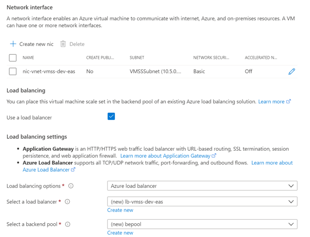

# Custom VMSS Deployment Walkthrough

[home](../README.md)

## Technical Implementation

### Step 1 - Create Custom Image Virtual Machine

1. Create [Linux - Ubuntu](https://docs.microsoft.com/en-us/azure/virtual-machines/linux/quick-create-portal) VM via Azure Portal

   

1. Configure VM as Ngnix Server
   Install web server
   ```
   sudo apt-get -y update
   sudo apt-get -y install nginx
   ```
   
1. Prepare VM images

   [Generalized and Specialized images](https://docs.microsoft.com/en-us/azure/virtual-machines/shared-image-galleries#generalized-and-specialized-images)

   **Option 1 - Create Custom Image from Generalized VM**

   [How to create a managed image of a virtual machine or VHD](https://docs.microsoft.com/en-us/azure/virtual-machines/linux/capture-image)

   \*Only follow the steps to generalize the VM

   **Option 2 - Create Disk Snapshot from Specialized VM**

   [Create a snapshot using the portal or PowerShell](https://docs.microsoft.com/en-us/azure/virtual-machines/windows/snapshot-copy-managed-disk)

   

### Step 2 - Create Shared Image Gallery

1. Create [Shared Image Gallery](https://docs.microsoft.com/en-us/azure/virtual-machines/linux/shared-images-portal)

   

1. Capture generalized VM with versioning

   

   

1. Test the created VM with new VM instance

   

   

   

   

### Step 3 - Create Virtual Machine Scale Sets

1. Create [Virtual Machine Scale Sets](https://docs.microsoft.com/en-us/azure/virtual-machine-scale-sets/quick-create-portal) and select prepared custom image

   

   

   

   

   

1. Configure endpoint with [Load Balancer](https://docs.microsoft.com/en-us/azure/load-balancer/load-balancer-overview) or [Application Gateway](https://docs.microsoft.com/en-us/azure/application-gateway/overview) for public access

   

   

   

### FAQ

1. What is the alternative for deploying custom VMSS without Shared Image Gallery?

1. How can I update the reference image without integration of Shared Image Gallery?

1. How can I protect the active session during scale-in operation? Will VMSS detect the session and wait until the session is done? Will VMSS stop distributing traffic to planned scale-in instance?
