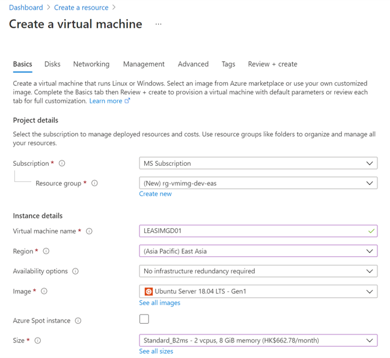

# Custom VMSS Deployment Walkthrough

## Technical Implementation

### Step 1 - Create Custom Image Virtual Machine

1. Create [Linux - Ubuntu](https://docs.microsoft.com/en-us/azure/virtual-machines/linux/quick-create-portal) VM via Azure Portal

   

1. Configure VM as Ngnix Server
   Install web server
   ```
   sudo apt-get -y update
   sudo apt-get -y install nginx
   ```
   
1. Generalize the VM as an image

### Step 2 - Create Shared Image Gallery

1. Create [Shared Image Gallery](https://docs.microsoft.com/en-us/azure/virtual-machines/windows/shared-images-portal) and store the VM image with versioning
1. Create [Virtual Machine Scale Sets](https://docs.microsoft.com/en-us/azure/virtual-machine-scale-sets/quick-create-portal) and select prepared custom image
1. Configure endpoint with [Load Balancer](https://docs.microsoft.com/en-us/azure/load-balancer/load-balancer-overview) or [Application Gateway](https://docs.microsoft.com/en-us/azure/application-gateway/overview) for public access
